# Expenso

> **Modern Android Finance Management App** - 100% Offline, Enterprise-Grade Security

## 📋 Table of Contents

1. [Overview](#-overview)
2. [Architecture](#-architecture)
3. [Security Architecture](#-security-architecture)
4. [Technology Stack](#-technology-stack)
5. [User Experience](#-user-experience)
6. [Development](#-development)
7. [Security Features](#️-security-features)
8. [Performance](#-performance)
9. [Data Flow](#-data-flow)
10. [UI/UX Design](#-uiux-design)
11. [Analytics & Reporting](#-analytics--reporting)
12. [Configuration](#-configuration)
13. [Getting Started](#-getting-started)
14. [Documentation](#-documentation)
15. [Support](#-support)

---

## 🎯 Overview

Expenso is a comprehensive personal finance management application built with modern Android architecture, featuring enterprise-grade security and 100% offline operation.

### ✨ Key Features

- **🔒 Enterprise Security** - Multi-layer encryption with biometric authentication
- **📱 Modern UI** - Material Design 3 with adaptive theming
- **🏗️ Clean Architecture** - MVVM pattern with domain-driven design
- **💾 100% Offline** - No internet required, all data stored locally
- **📊 Advanced Analytics** - Comprehensive financial insights and reporting
- **🛡️ Privacy First** - Your data never leaves your device

## 🏗️ Architecture

Expenso follows Clean Architecture principles with a modern Android implementation:

```mermaid
graph TB
    subgraph "📱 Presentation Layer"
        A[DashboardActivity<br/>Launcher & Navigation Host]
        B[Fragments<br/>UI Components]
        C[ViewModels<br/>MVVM Pattern]
        D[Adapters<br/>RecyclerView]
    end
    
    subgraph "🔧 Domain Layer"
        E[Entities<br/>Business Models]
        F[Use Cases<br/>Business Logic]
        G[Repositories<br/>Interfaces]
        H[Value Objects<br/>Money, etc.]
    end
    
    subgraph "💾 Data Layer"
        I[Repositories<br/>Implementations]
        J[SQLCipher DB<br/>Encrypted Storage]
        K[DAOs<br/>Data Access]
        L[Security<br/>Encryption]
    end
    
    A --> B
    B --> C
    C --> F
    F --> G
    G --> I
    I --> J
    J --> K
    I --> L
    
    classDef presentation fill:#e1f5fe
    classDef domain fill:#f3e5f5
    classDef data fill:#e8f5e8
    
    class A,B,C,D presentation
    class E,F,G,H domain
    class I,J,K,L data
```



## 🔒 Security Architecture

Multi-layer security implementation ensuring enterprise-grade protection:

```mermaid
graph TD
    subgraph "🛡️ Security Layers"
        A[Application Security<br/>Code Obfuscation]
        B[Authentication<br/>Biometric + PIN]
        C[Data Encryption<br/>AES-256-GCM]
        D[Database Security<br/>SQLCipher]
        E[Storage Security<br/>Android Keystore]
    end
    
    subgraph "🔍 Runtime Protection"
        F[Root Detection]
        G[Debug Detection]
        H[Emulator Detection]
        I[App Integrity]
        J[Memory Protection]
    end
    
    subgraph "📊 Security Monitoring"
        K[Audit Logging]
        L[Threat Detection]
        M[Session Management]
        N[Access Control]
    end
    
    A --> B
    B --> C
    C --> D
    D --> E
    
    F --> K
    G --> K
    H --> K
    I --> K
    J --> K
    
    K --> L
    L --> M
    M --> N
    
    classDef security fill:#ffebee
    classDef protection fill:#e3f2fd
    classDef monitoring fill:#f1f8e9
    
    class A,B,C,D,E security
    class F,G,H,I,J protection
    class K,L,M,N monitoring
```



## 🚀 Technology Stack

### Core Technologies
- **Language**: Java 17 (100%)
- **Architecture**: Clean Architecture + MVVM
- **Database**: SQLCipher 4.5.6+ (Encrypted Room Database)
- **UI**: Material Design 3 with adaptive theming
- **Navigation**: Activity-based navigation with Intent routing
- **Security**: Multi-layer encryption (AES-256-GCM + Android Keystore)
- **Threading**: AppExecutorService for background operations
- **State Management**: LiveData with ViewModels

### Key Libraries
- **Room Database** with SQLCipher 4.5.4 encryption
- **Material Design 3** (com.google.android.material)
- **Android Security Crypto** (EncryptedSharedPreferences)
- **BiometricPrompt** for authentication
- **Argon2** for password hashing
- **iText7** for PDF report generation
- **MPAndroidChart** for financial charts and visualizations
- **WorkManager** for scheduled backup operations

## 📱 User Experience

### Navigation Flow


### Key User Flows
1. **Authentication** - Biometric or PIN-based login
2. **Dashboard** - Financial overview and quick actions
3. **Transaction Management** - Add, edit, categorize transactions
4. **Budget Tracking** - Set and monitor spending limits
5. **Analytics** - Comprehensive financial insights
6. **Data Backup & Restore** - Manual and automatic backup operations
7. **Data Export** - PDF/CSV reports for external use
8. **Configuration** - System settings and category management

## 🔧 Development

### Project Structure
```
app/src/main/java/com/offline/expenso/
├── ExpensoApplication.java         # Application initialization orchestrator
├── presentation/                   # UI Layer (MVVM Pattern)
│   ├── ui/activities/             # Activities (Activity-based navigation)
│   │   ├── DashboardActivity.java # Launcher activity & financial overview
│   │   ├── TransactionsActivity.java # Transaction management
│   │   ├── BudgetsActivity.java   # Budget tracking
│   │   ├── AnalyticsActivity.java # Financial analytics
│   │   ├── SettingsActivity.java  # App settings
│   │   ├── AuthenticationActivity.java # User authentication
│   │   ├── DataBackupActivity.java # Data backup and restore
│   │   ├── ConfigurationActivity.java # System configuration
│   │   ├── ProfileActivity.java   # User profile management
│   │   ├── TransactionDetailsActivity.java # Transaction details view
│   │   ├── SecureQueryRunnerActivity.java # Secure query execution
│   │   └── AllActivitiesActivity.java # Activity grid view
│   ├── ui/fragments/              # Dialog fragments for data entry
│   ├── ui/viewmodels/             # ViewModels with LiveData
│   ├── ui/adapters/               # RecyclerView Adapters
│   ├── common/                    # Shared UI utilities
│   │   ├── base/                  # Base classes
│   │   ├── error/                 # Error handling
│   │   └── utils/                 # UI helpers
│   ├── theming/                   # Theme management
│   └── navigation/                # Navigation helpers
├── domain/                         # Business Logic (Clean Architecture)
│   ├── entities/                  # Domain Models (Business entities)
│   ├── usecases/                  # Business Use Cases
│   ├── repositories/              # Repository Interfaces (Contracts)
│   ├── services/                  # Domain Services
│   ├── enums/                     # Business Enums
│   └── value_objects/             # Immutable Value Objects (Money, etc.)
├── data/                           # Data Layer (Implementation)
│   ├── local/database/            # Room Database with SQLCipher
│   │   ├── entities/              # Database entities
│   │   ├── dao/                   # Data Access Objects
│   │   └── converters/            # Type converters
│   ├── local/dao/                 # Additional DAOs
│   ├── repositories/              # Repository Implementations
│   ├── mappers/                   # Domain ↔ Data mappers
│   ├── security/                  # Security components
│   │   ├── EncryptionManager.java # AES encryption
│   │   ├── DatabaseKeyManager.java # DB key management
│   │   ├── SessionManager.java    # Session handling
│   │   └── AndroidPasswordHashingService.java # Password hashing
│   ├── backup/                    # Data backup components
│   │   ├── BackupFileManager.java # Backup file management
│   │   ├── BackupScheduler.java  # WorkManager scheduling
│   │   ├── TransactionCsvExporter.java # CSV export
│   │   ├── TransactionCsvImporter.java # CSV import
│   │   └── AutoBackupWorker.java  # WorkManager worker
│   └── analytics/                 # OfflineAnalyticsEngine
└── core/                           # Shared Components
    ├── logging/                   # AppLogger
    ├── security/                  # Security utilities
    └── threading/                 # AppExecutorService
```

### Build Commands
- **Build the project**: Run `./gradlew build`
- **Run tests**: Run `./gradlew test`
- **Generate release APK**: Run `./gradlew assembleRelease`

## 🛡️ Security Features

### Data Protection
- **SQLCipher Database** with full database-level encryption (transaction data stored as plain text in encrypted database)
- **AES-256-GCM Encryption** for user credentials and session data
- **Android Keystore** for secure key storage
- **Biometric Authentication** with PIN fallback
- **EncryptedSharedPreferences** for secure session storage

### Runtime Security
- **Root Detection** - Prevents execution on compromised devices
- **Debug Detection** - Blocks debugging attempts
- **Emulator Detection** - Prevents analysis in emulated environments
- **App Integrity Verification** - Ensures app hasn't been tampered with

### Privacy Protection
- **100% Offline Operation** - No data transmission
- **Local Data Storage** - All data remains on device
- **Encrypted Backups** - Secure local backup system
- **Audit Logging** - Complete security event tracking

## 📊 Performance

### Optimization Features
- **Efficient Database Queries** with proper indexing
- **Memory Management** with lifecycle-aware components
- **Background Processing** with ExecutorService
- **Caching Strategies** for improved performance

### Performance Targets
- **App Launch**: < 2 seconds
- **Database Queries**: < 100ms average
- **UI Animations**: 60 FPS
- **Memory Usage**: < 100MB peak

## 🔄 Data Flow


## 🎨 UI/UX Design

### Material Design 3 Implementation
- **Dynamic Theming** - Light/Dark mode support
- **Adaptive Colors** - System color integration
- **Modern Components** - Latest Material Design components
- **Accessibility** - WCAG 2.1 AA compliance

### Navigation Architecture
- **Single Activity Pattern** - Modern Android approach
- **Navigation Component** - Type-safe navigation
- **Deep Linking** - URL-based navigation support
- **Back Stack Management** - Proper navigation handling

## 📈 Analytics & Reporting

### Financial Insights
- **Spending Analysis** - Category-wise breakdown
- **Income Tracking** - Revenue source analysis
- **Budget Performance** - Goal vs actual spending
- **Trend Analysis** - Historical data patterns

### Export Capabilities
- **PDF Reports** - Professional financial reports
- **CSV Export** - Data for external analysis
- **JSON Backup** - Complete data backup
- **Custom Date Ranges** - Flexible reporting periods

## 🔧 Configuration

### User Settings
- **Currency Selection** - Multi-currency support
- **Theme Preferences** - Light/Dark mode
- **Security Settings** - Biometric/PIN configuration
- **Notification Preferences** - Reminder settings

### System Configuration
- **Database Encryption** - Automatic security setup
- **Backup Scheduling** - Automated data protection
- **Performance Tuning** - Optimized for device capabilities

## 🚀 Getting Started

### Prerequisites
- **Android Studio**: Hedgehog (2023.1.1) or later
- **Android SDK**: API 24+ (Android 7.0) minimum, API 35 (Android 15) target
- **Java**: 17
- **Gradle**: 8.0+ (included via Gradle Wrapper)

### Installation
1. Clone the repository and navigate to the project directory
2. Open in Android Studio
3. Sync project with Gradle files (download dependencies automatically)
4. Configure signing (optional for debug builds):
   - Copy `keystore.properties.example` to `keystore.properties`
   - Fill in your signing credentials (for release builds)
5. Build and run on device/emulator using `./gradlew installDebug`

### First Run
1. **App Launch**: Application initializes heavy components asynchronously
   - Critical components (SessionManager, ThemeManager) initialize synchronously
   - Database, encryption, and repositories initialize in background
   - Activities wait for initialization via `InitializationListener` pattern
2. **User Registration**: Create account with email and password
   - Password hashed using PBKDF2 with Argon2
   - User data encrypted before storage
3. **Authentication Setup**: Choose biometric or PIN authentication
   - Biometric: Uses Android BiometricPrompt API
   - PIN: 6-digit secure PIN with pattern detection
4. **Create First Transaction**: Add income or expense transaction
   - Supports multiple currencies
   - Category-based organization
   - Transaction data fully encrypted
5. **Explore Features**: 
   - Dashboard: Financial overview with recent transactions
   - Analytics: View spending trends and category breakdowns
   - Budgets: Set and track spending limits
   - Settings: Configure app preferences and theme

### Application Initialization Flow

The app uses a two-phase initialization strategy to prevent blocking the main thread:

1. **Critical Phase (Synchronous)**:
   - SessionManager initialization
   - ThemeManager initialization
   - Main thread remains responsive

2. **Heavy Phase (Asynchronous)**:
   - EncryptionManager setup (Android Keystore access)
   - Database initialization (SQLCipher setup)
   - Repository instantiation
   - Service configuration
   - Runs on background thread pool

Activities use the `InitializationListener` pattern to wait for initialization before accessing repositories, preventing race conditions and `NullPointerException`s.

**Note**: `DashboardActivity` serves as the launcher activity, replacing the previous `MainActivity`. It combines authentication checks, session management, deep link routing, and the dashboard UI in a single activity for improved performance and simplicity.

## 📚 Documentation

Comprehensive documentation is available in the `docs/` directory:

### User Documentation
- **[User Guide](docs/USER_GUIDE.md)** - Complete user manual with step-by-step instructions
  - Getting started, authentication, and account setup
  - Transaction management and categorization
  - Budget tracking and financial goals
  - Analytics and reporting features
  - Data backup and restore procedures
  - Troubleshooting and FAQs

- **[Query Runner Guide](docs/QUERY_RUNNER.md)** - Advanced SQL query feature documentation
  - SQL query execution and security
  - Transaction table schema reference
  - 30+ sample queries and use cases
  - Best practices and optimization tips

### Technical Documentation
- **[Features Documentation](docs/FEATURES.md)** - Detailed feature specifications
  - Authentication and security features
  - Transaction and budget management
  - Analytics and data export capabilities
  - UI/UX implementation details
  - Application lifecycle and performance

- **[Architecture Guide](docs/ARCHITECTURE.md)** - System architecture and design
  - Clean Architecture implementation
  - Component architecture and data flow
  - Database schema and relationships
  - Performance optimization strategies
  - Application initialization flow

- **[Security Implementation](docs/SECURITY.md)** - Security architecture details
  - Multi-layer security model
  - Encryption and key management
  - Authentication and session management
  - Runtime protection mechanisms
  - Cryptographic corruption recovery

### Legal
- **[Terms and Conditions](docs/TERMS_AND_CONDITIONS.md)** - Application terms of use
  - User responsibilities and disclaimers
  - Privacy and data protection
  - Limitations of liability
  - Usage restrictions

## 📞 Support

For technical support or feature requests, please refer to the project documentation above or create an issue in the repository.

---

**expenso** - Secure, Modern, Offline-First Financial Management
