# Expenso - Architecture Guide

## 📋 Table of Contents

1. [System Architecture Overview](#️-system-architecture-overview)
2. [Architecture Principles](#-architecture-principles)
3. [Layer Responsibilities](#-layer-responsibilities)
4. [Data Flow Architecture](#-data-flow-architecture)
5. [Component Architecture](#️-component-architecture)
6. [Database Architecture](#️-database-architecture)
7. [Security Architecture](#-security-architecture)
8. [Navigation Architecture](#-navigation-architecture)
9. [Performance Architecture](#-performance-architecture)
10. [State Management](#-state-management)
11. [Testing Architecture](#-testing-architecture)
12. [Package Structure](#-package-structure)
13. [Key Architectural Decisions](#-key-architectural-decisions)
14. [Application Initialization Architecture](#-application-initialization-architecture)
15. [Scalability Considerations](#-scalability-considerations)
16. [Related Documentation](#-related-documentation)

---

## 🏗️ System Architecture Overview

Expenso implements a modern Clean Architecture with Android-specific optimizations, ensuring maintainability, testability, and scalability.

## 📐 Architecture Principles

### Clean Architecture Layers

```mermaid
graph TB
    subgraph "🎯 Core Principles"
        A[Independence]
        B[Testability]
        C[Maintainability]
        D[Scalability]
    end
    
    subgraph "📱 Presentation Layer"
        E[Activities & Fragments]
        F[ViewModels]
        G[UI Components]
        H[Navigation]
    end
    
    subgraph "🔧 Domain Layer"
        I[Entities]
        J[Use Cases]
        K[Repository Interfaces]
        L[Business Rules]
    end
    
    subgraph "💾 Data Layer"
        M[Repository Implementations]
        N[Database]
        O[External APIs]
        P[Local Storage]
    end
    
    A --> B
    B --> C
    C --> D
    
    E --> F
    F --> G
    G --> H
    
    I --> J
    J --> K
    K --> L
    
    M --> N
    N --> O
    O --> P
    
    classDef principles fill:#e8f5e8
    classDef presentation fill:#e1f5fe
    classDef domain fill:#f3e5f5
    classDef data fill:#fff3e0
    
    class A,B,C,D principles
    class E,F,G,H presentation
    class I,J,K,L domain
    class M,N,O,P data
```



## 🎯 Layer Responsibilities

### Presentation Layer
- **UI Components**: Activities, Fragments, Custom Views
- **State Management**: ViewModels with LiveData
- **User Interaction**: Event handling and navigation
- **Data Binding**: UI to data synchronization

### Domain Layer
- **Business Logic**: Use cases and business rules
- **Entities**: Core business models
- **Repository Interfaces**: Data access contracts
- **Value Objects**: Immutable domain concepts

### Data Layer
- **Repository Implementations**: Data access logic
- **Database**: SQLCipher encrypted storage
- **Security**: Encryption and authentication
- **Local Storage**: File and preference management

## 🔄 Data Flow Architecture


## 🏛️ Component Architecture

### Main Components


## 🗄️ Database Architecture

### SQLCipher Database Structure


## 🔐 Security Architecture

### Multi-Layer Security Model


## 🧭 Navigation Architecture

### Activity-Based Navigation


## ⚡ Performance Architecture

### Optimization Strategies

```mermaid
graph TB
    subgraph "🚀 Performance Layers"
        A[UI Optimization<br/>RecyclerView + DiffUtil]
        B[Memory Management<br/>Lifecycle Awareness]
        C[Database Optimization<br/>Indexing + Caching]
        D[Background Processing<br/>ExecutorService]
    end
    
    subgraph "📊 Monitoring"
        E[Performance Metrics]
        F[Memory Usage]
        G[Database Performance]
        H[UI Responsiveness]
    end
    
    A --> E
    B --> F
    C --> G
    D --> H
    
    classDef performance fill:#e8f5e8
    classDef monitoring fill:#e1f5fe
    
    class A,B,C,D performance
    class E,F,G,H monitoring
```



## 🔄 State Management

### MVVM Pattern Implementation

```mermaid
graph LR
    subgraph "📱 View Layer"
        A[Fragment]
        B[Activity]
        C[Custom Views]
    end
    
    subgraph "🧠 ViewModel Layer"
        D[TransactionViewModel]
        E[DashboardViewModel]
        F[BudgetViewModel]
    end
    
    subgraph "🔧 Model Layer"
        G[Repository]
        H[Use Cases]
        I[Entities]
    end
    
    A --> D
    B --> E
    C --> F
    
    D --> G
    E --> H
    F --> I
    
    classDef view fill:#e1f5fe
    classDef viewmodel fill:#f3e5f5
    classDef model fill:#e8f5e8
    
    class A,B,C view
    class D,E,F viewmodel
    class G,H,I model
```



## 🧪 Testing Architecture

### Testing Strategy


## 📦 Package Structure

### Clean Package Organization

```
com.offline.expenso/
├── 📱 presentation/          # UI Layer
│   ├── ui/activities/       # Activities
│   ├── ui/viewmodels/       # ViewModels
│   ├── ui/adapters/         # RecyclerView Adapters
│   ├── ui/fragments/        # Dialog Fragments
│   ├── ui/dialogs/          # Dialog Components
│   ├── common/base/         # Base Classes
│   ├── common/utils/        # UI Utilities
│   ├── theming/             # Theme Management
│   └── navigation/          # Navigation Helpers
├── 🔧 domain/               # Business Logic
│   ├── entities/            # Domain Models
│   │   ├── Budget           # Budget with recurring support
│   │   ├── BudgetHistory    # Budget period snapshots
│   │   └── ...              # Other entities
│   ├── usecases/            # Business Use Cases
│   ├── repositories/        # Repository Interfaces
│   ├── services/            # Domain Services
│   ├── enums/               # Business Enums
│   └── value_objects/       # Value Objects
├── 💾 data/                 # Data Layer
│   ├── local/database/      # Room Database
│   ├── local/dao/           # Data Access Objects
│   ├── repositories/        # Repository Implementations
│   │   ├── BudgetRepository         # Budget CRUD
│   │   ├── BudgetHistoryRepository  # History access
│   │   └── ...
│   ├── security/            # Security Components
│   ├── backup/              # Backup & Restore System
│   │   ├── BackupManager        # Multi-table backup orchestrator
│   │   ├── RestoreManager       # Multi-table restore orchestrator
│   │   ├── ZipBackupHandler     # ZIP archive handling
│   │   ├── ManifestManager      # Manifest JSON handling
│   │   ├── models/              # Backup/restore models
│   │   ├── exporters/           # Table-specific CSV exporters (7)
│   │   └── importers/           # Table-specific CSV importers (7)
│   ├── budget/              # Budget Workers
│   │   ├── BudgetResetWorker       # Period reset
│   │   └── BudgetResetScheduler    # Scheduler
│   ├── mappers/             # Data Mappers
│   └── analytics/           # Analytics Engine
└── 🔒 core/                 # Shared Components
    ├── security/            # Security Utilities
    └── threading/           # ExecutorService Management
```

## 🎯 Key Architectural Decisions

### 1. Activity-Based Navigation Pattern
- **Benefit**: Clear separation of concerns and better back stack management
- **Implementation**: Multiple activities with Intent-based navigation and deep link support

### 2. Clean Architecture
- **Benefit**: Separation of concerns and testability
- **Implementation**: Clear layer boundaries with dependency inversion

### 3. MVVM Pattern
- **Benefit**: Reactive UI updates and lifecycle management
- **Implementation**: ViewModels with LiveData for state management

### 4. Repository Pattern
- **Benefit**: Data source abstraction and testability
- **Implementation**: Interface-based repositories with secure implementations

### 5. Security-First Design
- **Benefit**: Enterprise-grade data protection
- **Implementation**: Multi-layer encryption with Android Keystore and EncryptedSharedPreferences

### 6. Centralized Thread Management
- **Benefit**: Efficient resource utilization and better performance
- **Implementation**: AppExecutorService with dedicated database and background thread pools

### 7. Two-Phase Application Initialization
- **Benefit**: Prevents main thread blocking while ensuring proper initialization order
- **Implementation**: 
  - Critical components (SessionManager, ThemeManager) initialize synchronously
  - Heavy components (Database, Encryption, Repositories) initialize asynchronously
  - Activities use InitializationListener pattern to wait for completion
  - 15-second timeout with automatic recovery on failure

### 8. Unified Launcher Activity
- **Benefit**: Simplified architecture with direct entry to functional content
- **Implementation**: 
  - `DashboardActivity` serves as both launcher activity and dashboard UI
  - Combines authentication checks, session management, deep link routing, and dashboard functionality
  - Eliminates intermediate activity step for faster app launch
  - All other activities have `DashboardActivity` as parent activity

## 🔄 Application Initialization Architecture

### Initialization Flow


### Initialization Components

#### Critical Phase (Synchronous - Main Thread)
1. **SessionManager**: Needed immediately for authentication checks
   - Lightweight initialization
   - Uses EncryptedSharedPreferences
   - Handles session recovery automatically

2. **ThemeManager**: Required for UI rendering
   - Applies user theme preference
   - Validates theme settings
   - Minimal overhead

#### Heavy Phase (Asynchronous - Background Thread)
1. **EncryptionManager**: Setup encryption infrastructure
   - Android Keystore access (may be slow on first access)
   - Master key generation/retrieval
   - Database passphrase derivation

2. **AppDatabase**: SQLCipher database initialization
   - Database file creation/opening
   - SQLCipher passphrase setup
   - Schema validation and migration
   - Potentially slow on first launch

3. **Repositories**: Data access layer initialization
   - TransactionSecureRepository
   - UserSecureRepository
   - BudgetRepository
   - BudgetHistoryRepository
   - ConfigurationRepository

4. **Domain Services**: Business logic services
   - ConfigurationService
   - ConfigurationSeedingService
   - UserRegistrationService

5. **WorkManager Schedulers**: Background task scheduling
   - BudgetResetScheduler (daily budget period reset)
   - Auto backup scheduler (user-configured frequency)

### Initialization Safety Mechanisms

#### Thread Safety
- **AtomicBoolean**: Thread-safe initialization state tracking
- **CountDownLatch**: Synchronization primitive for blocking wait
- **CopyOnWriteArrayList**: Thread-safe listener management
- **Volatile Fields**: Safe publication of initialized components

#### Error Handling
- **Exception Capture**: All initialization errors captured and stored
- **Initialization Error**: Exception stored for later retrieval
- **Timeout Protection**: 15-second timeout prevents indefinite blocking
- **Automatic Recovery**: Retry mechanism for transient failures

#### Activity Integration
- **InitializationListener**: Interface for async notification
- **addInitializationListener()**: Register for initialization completion
- **removeInitializationListener()**: Clean up listeners
- **isInitialized()**: Check initialization status synchronously
- **awaitInitialization()**: Block until initialization (with timeout)

### Initialization Sequence Example

**DashboardActivity (Launcher Activity) Initialization Flow:**
1. Check authentication first - redirect to `AuthenticationActivity` if user is not logged in
2. Set content view to dashboard layout
3. Initialize theme and handle deep links
4. Initialize ViewModels using the `InitializationListener` pattern:
   - If app is already initialized, proceed immediately with ViewModel setup
   - If not initialized, register an `InitializationListener` to wait for completion
   - Handle initialization failures by showing error messages
   - Ensure all UI updates occur on the main thread and check activity lifecycle state

### Performance Considerations

#### Optimization Strategies
- **Lazy Initialization**: Only initialize when needed
- **Background Processing**: Heavy work on background threads
- **Timeout Protection**: Prevent indefinite waiting
- **Graceful Degradation**: Continue with partial initialization if possible

#### Initialization Timing
- **First Launch**: ~2-5 seconds (database creation, key generation)
- **Subsequent Launches**: ~500ms-1s (database opening, key retrieval)
- **Timeout**: 15 seconds maximum wait time
- **Recovery Time**: Additional 2-3 seconds if recovery needed

### Memory Management

#### Lifecycle Integration
- **onLowMemory()**: Clean up caches, close database connections
- **onTrimMemory()**: Release non-essential resources
- **onTerminate()**: Not reliable on production devices, not used

#### Resource Cleanup
- **Database Closing**: Proper SQLCipher connection closure
- **Executor Shutdown**: Graceful executor service shutdown
- **Listener Cleanup**: Remove initialization listeners on activity destroy

## 🚀 Scalability Considerations

### Horizontal Scaling
- **Modular Architecture**: Easy to add new features
- **Clean Interfaces**: Simple to extend functionality
- **Testable Components**: Reliable feature additions

### Vertical Scaling
- **Performance Optimization**: Efficient database queries
- **Memory Management**: Lifecycle-aware components
- **Background Processing**: Non-blocking operations

### Future Enhancements
- **Plugin Architecture**: Extensible functionality
- **API Integration**: External service connectivity
- **Cloud Sync**: Optional data synchronization

---

## 📚 Related Documentation

- **[README.md](../README.md)** - Project overview, technology stack, and getting started guide
- **[FEATURES.md](FEATURES.md)** - Comprehensive feature documentation
- **[SECURITY.md](SECURITY.md)** - Security implementation details
- **[USER_GUIDE.md](USER_GUIDE.md)** - Complete user manual with instructions
- **[QUERY_RUNNER.md](QUERY_RUNNER.md)** - Advanced SQL query feature guide
- **[TERMS_AND_CONDITIONS.md](TERMS_AND_CONDITIONS.md)** - Application terms of use